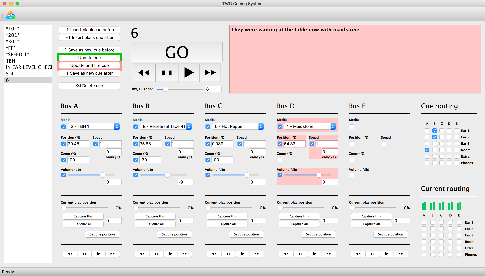

# TWGVideoCueing

Requires Python 3, PyQt5, python-osc, and rtmidi. On a mac:

```
/usr/bin/ruby -e "$(curl -fsSL https://raw.githubusercontent.com/Homebrew/install/master/install)"
brew install python3
pip3 install pyqt5
pip3 install python-osc
pip3 install rtmidi
```


