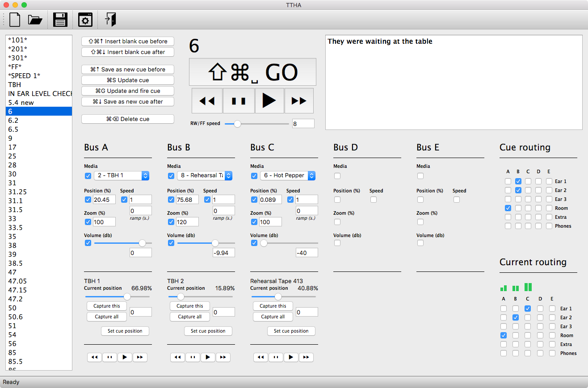

# TWGVideoCueing

Requires Python 3, PyQt5, python-osc, and rtmidi. On a mac:

```
/usr/bin/ruby -e "$(curl -fsSL https://raw.githubusercontent.com/Homebrew/install/master/install)"
brew install python3
pip3 install pyqt5
pip3 install python-osc
pip3 install rtmidi
```

To bundle into a standalone on a mac:
```
pip3 install -U py2app
py2applet --make-setup TWG\ SM\ Cueing.py
rm -rf build dist
python3 setup.py py2app -A
cd dist/TWG\ SM\ Cueing.app/Contents/Resources/
ln -s ../../../../data data
ln -s ../../../../icons icons
```


